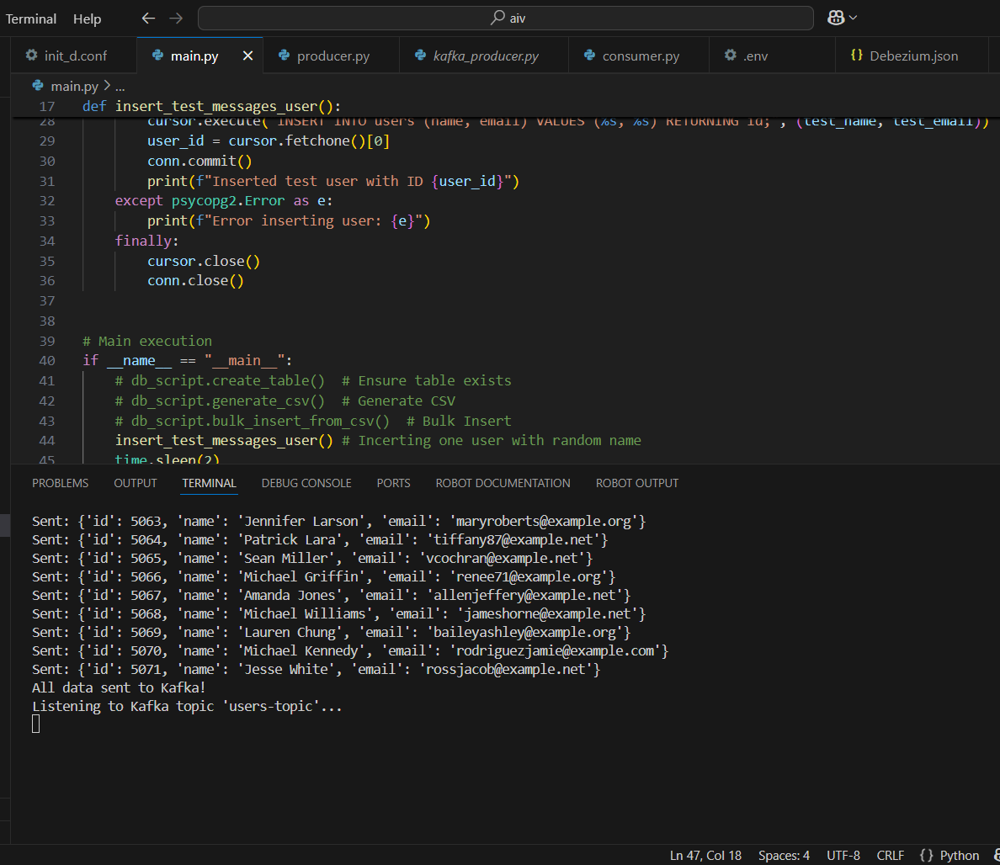
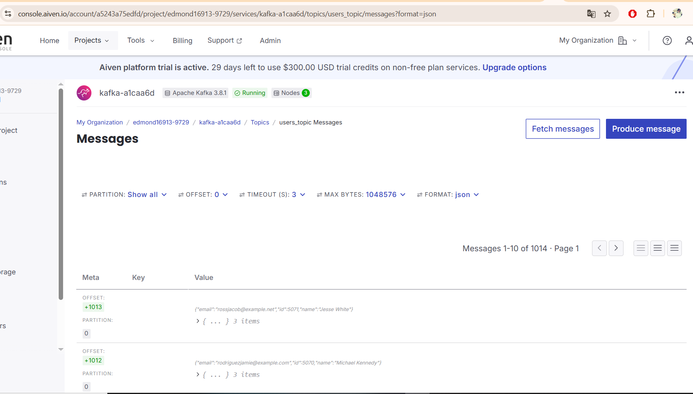

This project sets up a PostgreSQL database, Kafka topic, producer, and consumer using AWS services. The goal is to stream data from a database table to Kafka in real time.

Features
PostgreSQL Setup: Creates a table and inserts bulk test data.
Kafka Producer: Sends data to a Kafka topic.
Kafka Consumer: Reads messages from Kafka.
Environment Handling: Uses .env to manage secrets securely.
Bulk Inserts: Uses COPY for efficient data loading.
[TODO] Debezium Setup: Pending database change capture (CDC).

## **Screenshots**
### **Kafka Producer Running**

### Kafka Consumer Receiving Messages**

### Console Showing Services**

